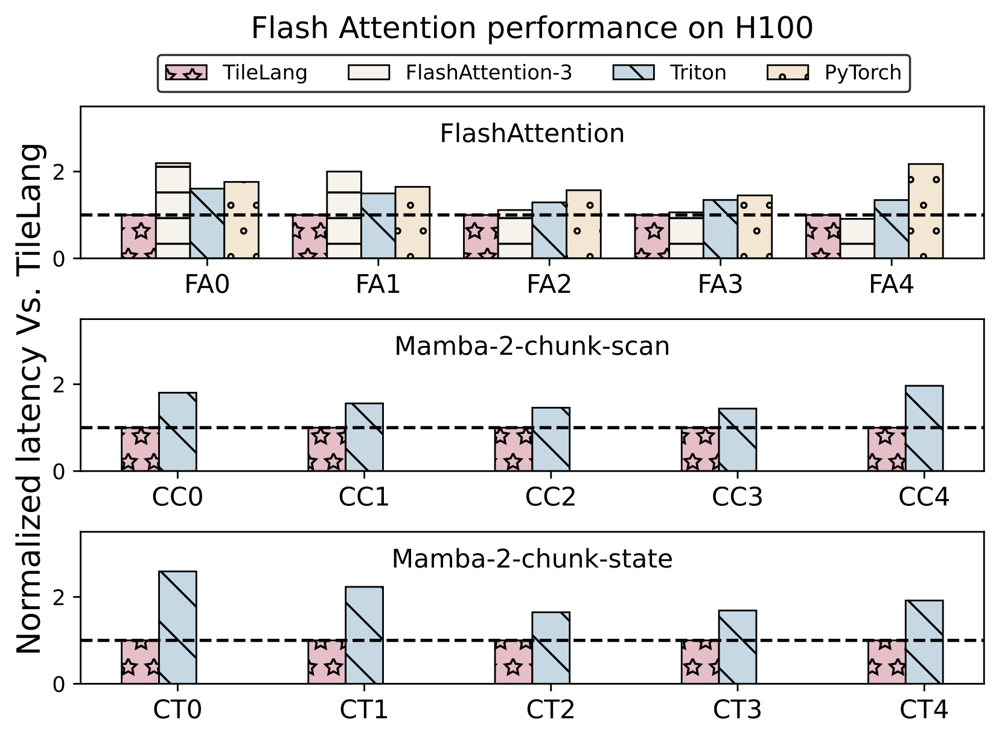
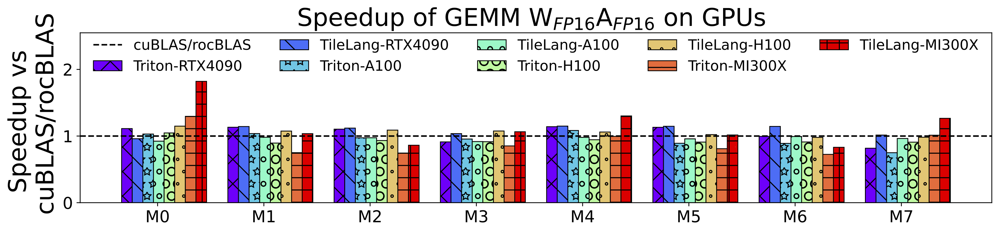
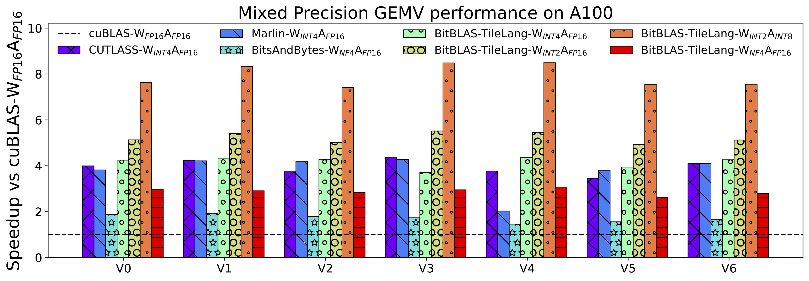

  <h1> Tile Lang Benchmark </h1>

## Benchmark Summary

TileLang achieves exceptional performance across a variety of computational patterns. Below are selected results showcasing its capabilities:

- Flash Attention Performance on H100

  
    
  

- Matmul Performance on GPUs (RTX 4090, A100, H100, MI300X)

  

    
  

- Dequantize Matmul Performance on A100

  

    
  

## Benchmark OP Set

以下是将这三张表格转为 Markdown 格式的示例。可根据需要自行调整排版、对齐或添加说明。

---

### Table 1: Matrix shapes in our benchmark

|     | V0    | V1    | V2    | V3    | V4    | V5    | V6    | V7    |
|-----|-------|-------|-------|-------|-------|-------|-------|-------|
| m   | 1     | 1     | 1     | 1     | 1     | 1     | 1     | 1     |
| n   | 16384 | 43008 | 14336 | 57344 | 14336 | 9216  | 36864 | 9216  |
| k   | 16384 | 14336 | 14336 | 14336 | 57344 | 9216  | 9216  | 36864 |

|     | M0   | M1   | M2    | M3    | M4   | M5   | M6    | M7    |
|-----|------|------|-------|-------|------|------|-------|-------|
| m   | 4096 | 4096 | 4096  | 4096  | 8192 | 8192 | 8192  | 8192  |
| n   | 1024 | 8192 | 28672 | 8192  | 1024 | 8192 | 28672 | 8192  |
| k   | 8192 | 8192 | 8192  | 28672 | 8192 | 8192 | 8192  | 28672 |

---

### Table 2: FlashAttention shapes in our benchmark

|      | FA0   | FA1   | FA2   | FA3   | FA4   |
|------|-------|-------|-------|-------|-------|
| batch   | 1     | 1     | 1     | 1     | 1     |
| nheads  | 32    | 32    | 32    | 32    | 32    |
| seq_len | 512   | 512   | 1024  | 1024  | 4096  |
| head_dim| 128   | 128   | 128   | 128   | 128   |
| causal  | true  | false | true  | false | true  |

---

### Table 3: Linear Attention shapes in our benchmark

|      | CC0  | CC1  | CC2  | CC3  | CC4  | CC5  |
|------|------|------|------|------|------|------|
| batch   | 1    | 1    | 1    | 64   | 64   | 64   |
| nheads  | 64   | 64   | 64   | 64   | 64   | 64   |
| seq_len | 1024 | 2048 | 8192 | 1024 | 2048 | 8192 |
| head_dim| 64   | 64   | 64   | 64   | 64   | 64   |
| d_state | 128  | 128  | 128  | 128  | 128  | 128  |

|      | CT0  | CT1  | CT2  | CT3  | CT4  | CT5  |
|------|------|------|------|------|------|------|
| batch   | 1    | 1    | 1    | 64   | 64   | 64   |
| nheads  | 64   | 64   | 64   | 64   | 64   | 64   |
| seq_len | 1024 | 2048 | 8192 | 1024 | 2048 | 8192 |
| head_dim| 64   | 64   | 64   | 64   | 64   | 64   |
| d_state | 128  | 128  | 128  | 128  | 128  | 128  |

---
